
<h1 align="center">基于Javaweb的图书管理系统的设计与实现</h1>

## 简介
图书管理系统：角色分为管理员和学员；功能包括书籍信息管理、借书卡管理、图书借阅与归还、用户个人信息管理、系统登录注册等。界面简洁，提高用户体验。    --计算机毕业设计源码；毕设源码；java毕业设计源码

## 联系方式

<h3 align="center">获取完整代码与数据库文件 + 微信：deepguan QQ: 86050149 QQ群: 783742310</h3>

<h3 align="center">可帮忙远程部署 包运行成功！提供远程部署、修改代码、设计文档指导、代码讲解等服务！</h3>

## 功能介绍（完整见运行截图）
管理员：具备的基本功能包括登录系统以管理账户，查看和修改个人信息。可以使用导航菜单方便地访问不同的管理模块，包括学员管理、借书卡管理、图书分类管理、图书信息管理、图书借阅和归还管理等功能。管理员可以添加、编辑或删除图书信息，修改图书类别，并管理学生的信息及借书卡。借还书管理中提供了审核及记录管理的功能，帮助维护管理系统顺畅运行。

用户：可以通过注册和登录界面进入系统，选择成为学员角色后，能够查看和编辑自身的基本信息。用户可以浏览书籍的信息，包括书名、作者、ISBN、状态及封面等，并根据不同类别或通过搜索来查找图书。用户有权限进行图书的借阅操作，查看已借阅图书的状态并根据需要归还图书。个人中心中，用户可以查看自己的注册信息，并进行相关的修改，确保信息正确。

## 运行截图
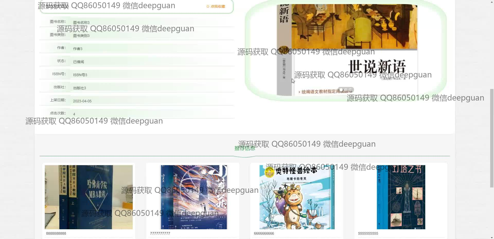
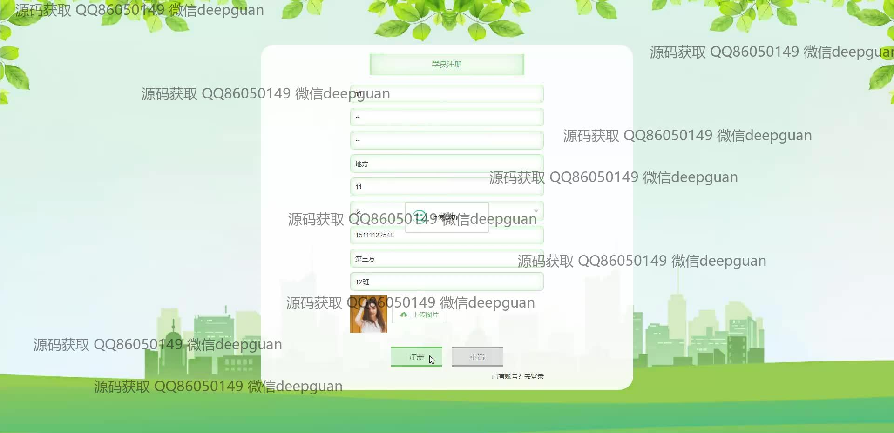
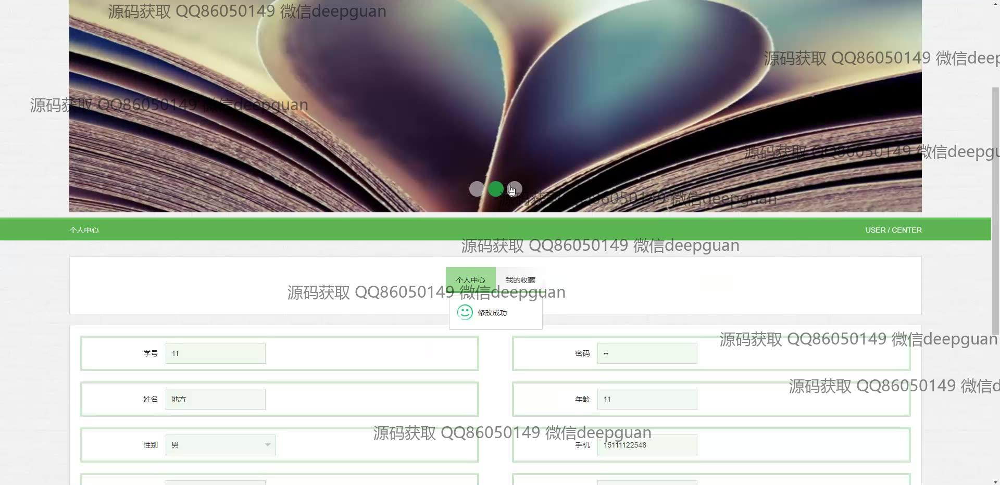
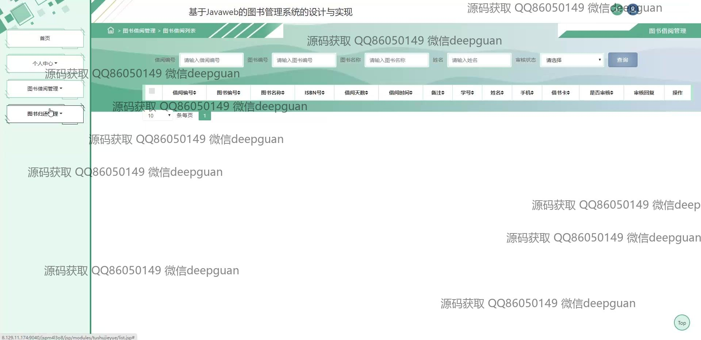
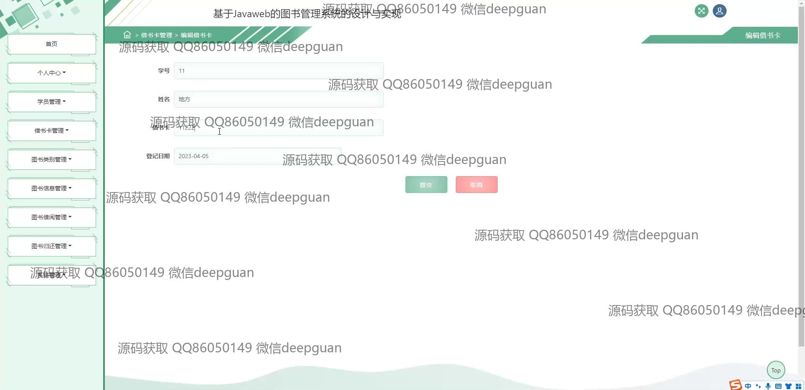
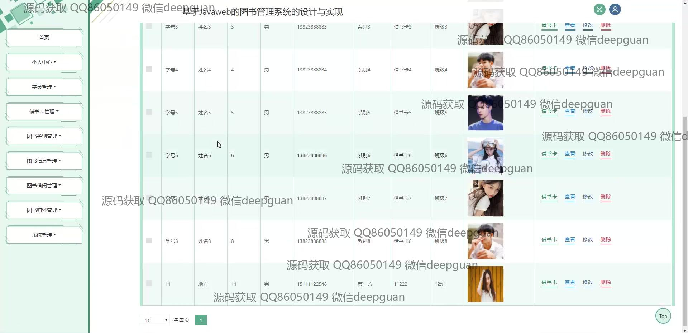
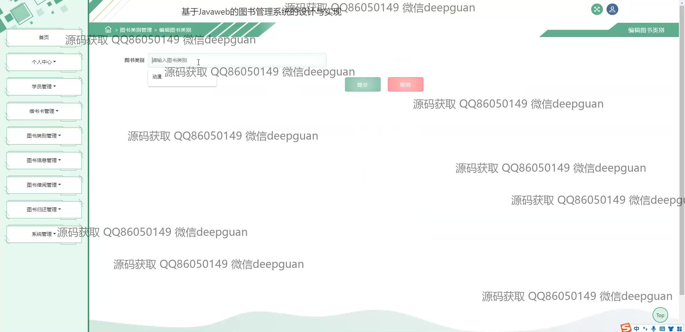
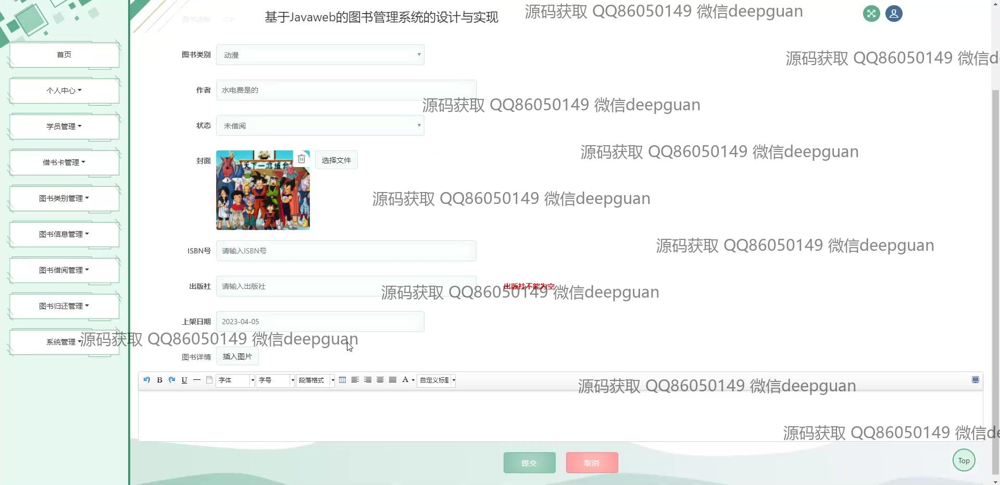
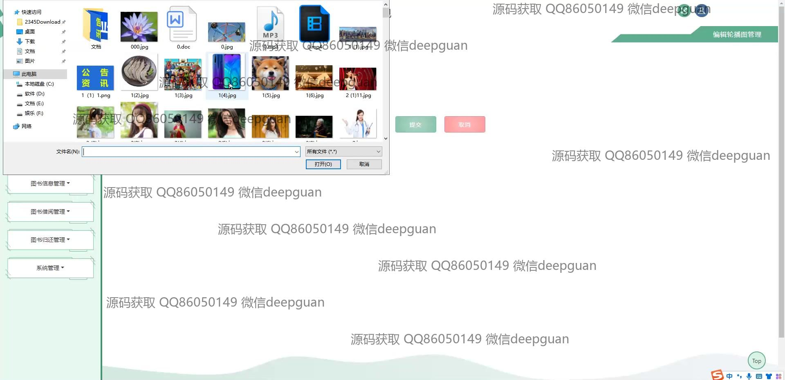
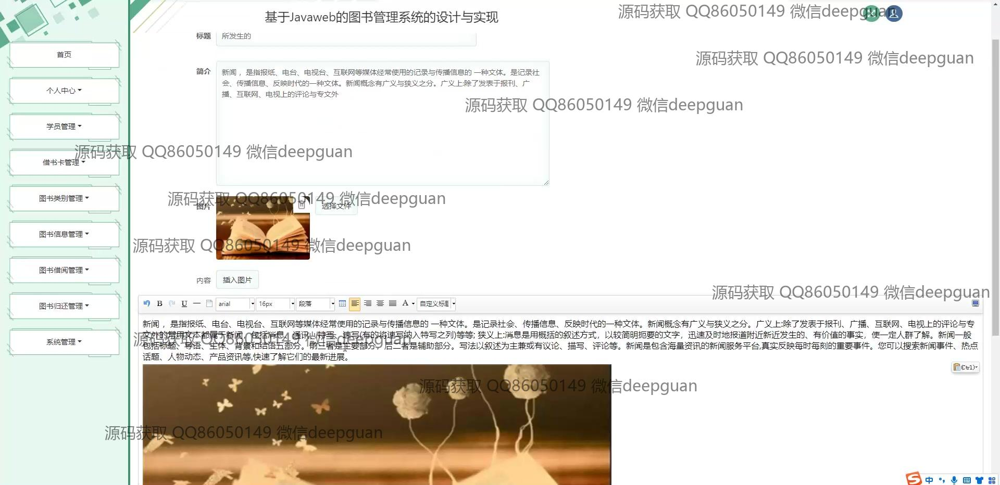
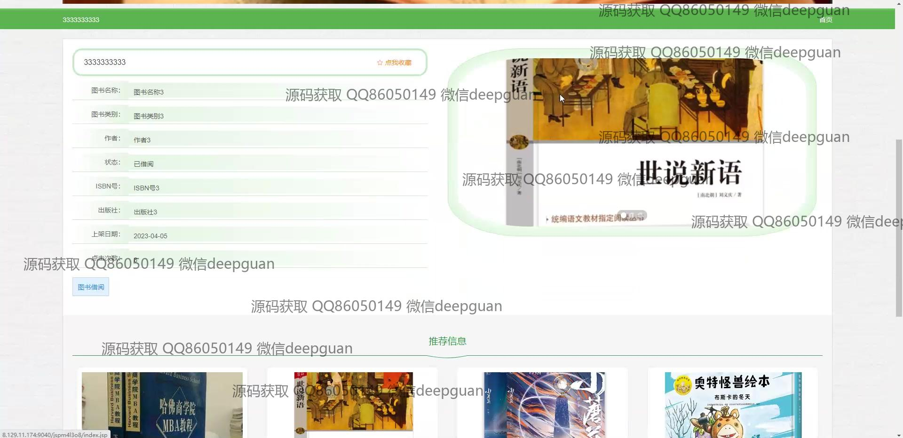
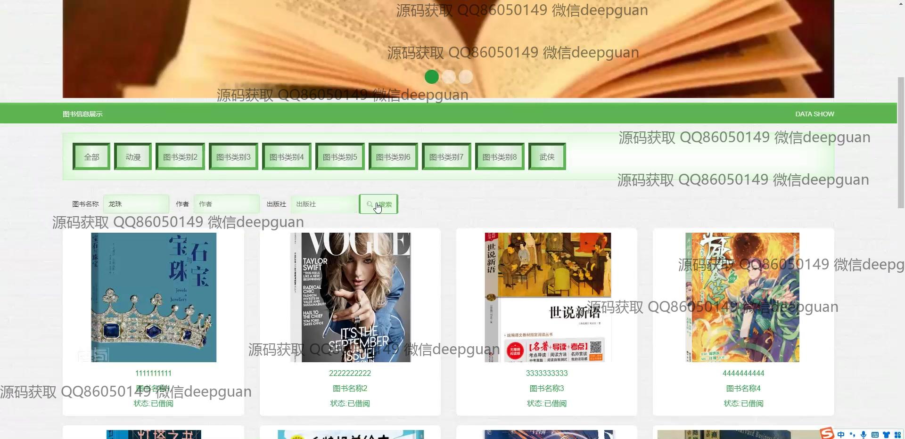
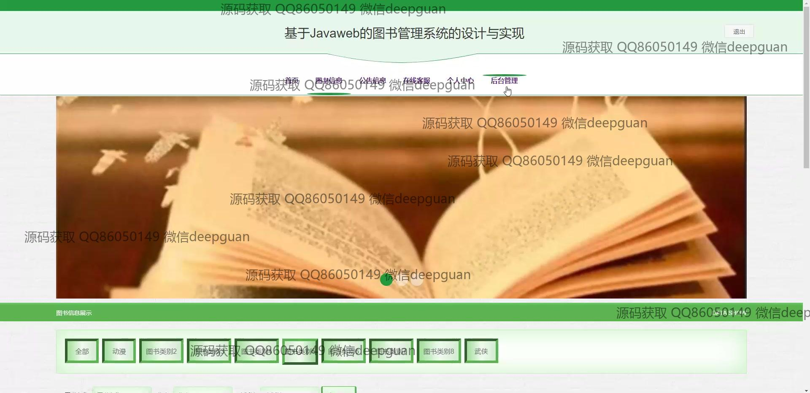
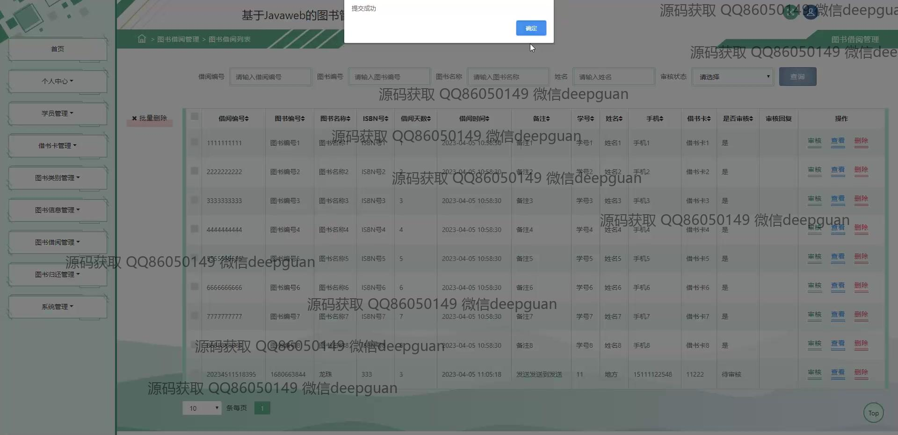
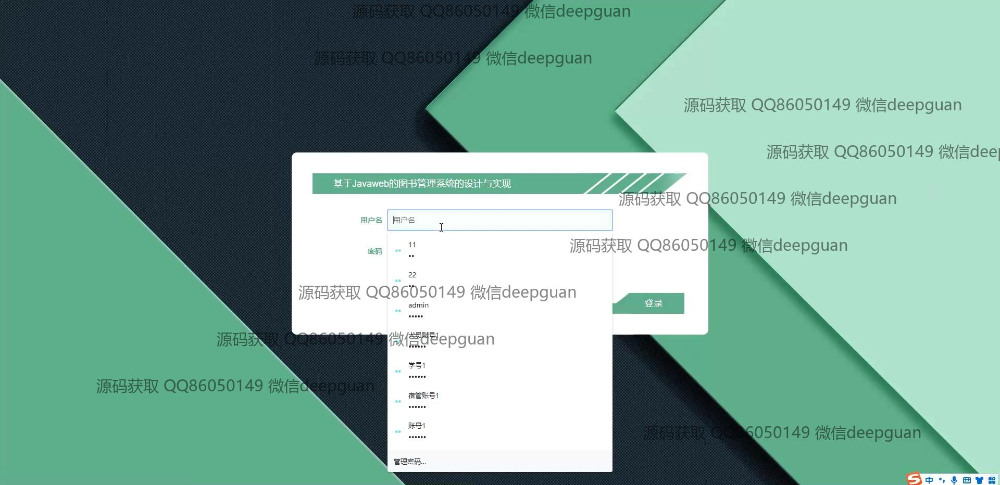
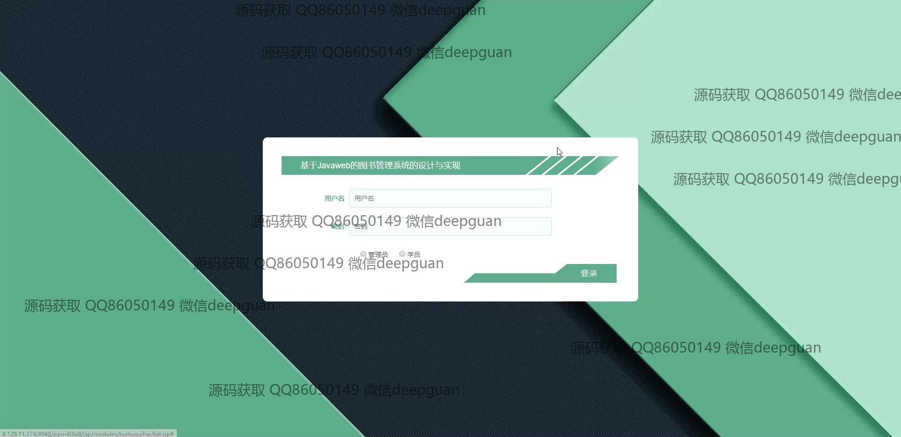

本代码来源于网络,仅供学习参考使用!

